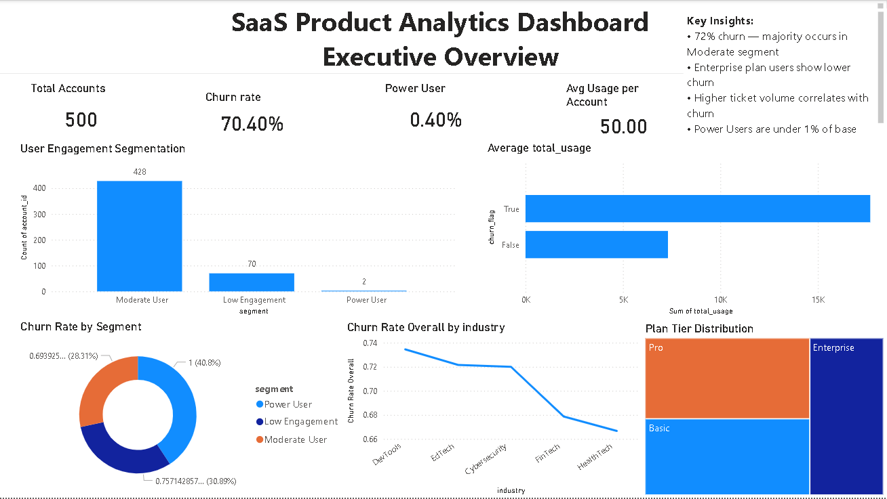

# 📊 SaaS Product Analytics Dashboard

## 🚀 Project Overview

This project presents an executive-level product analytics dashboard built using Power BI and DAX.  

The objective was to analyze user engagement, churn behavior, subscription tier distribution, and usage-support relationships in a SaaS business environment.

---

## 🎯 Business Problem

A SaaS company wants to:

- Understand churn drivers
- Identify engagement segments
- Evaluate subscription plan distribution
- Analyze relationship between product usage and support activity

---

## 🛠 Tools Used

- Power BI
- DAX
- Data Modeling
- CSV datasets (SaaS subscription data)

---

## 📈 Key Metrics

- Total Accounts
- Churn Rate
- Power User %
- Average Usage per Account
- Churn Rate by Segment
- Churn Rate by Industry
- Plan Tier Distribution
- Usage vs Support Tickets Analysis

---

## 🔍 Key Insights

- ~70% churn rate, majority within Moderate engagement segment
- Power Users represent less than 1% of user base
- Enterprise plan users show lower churn behavior
- Higher support ticket volume correlates with churn
- Industry variation significantly impacts retention

---

## 📸 Dashboard Preview

### Executive Overview

---

## 📂 Project Structure

